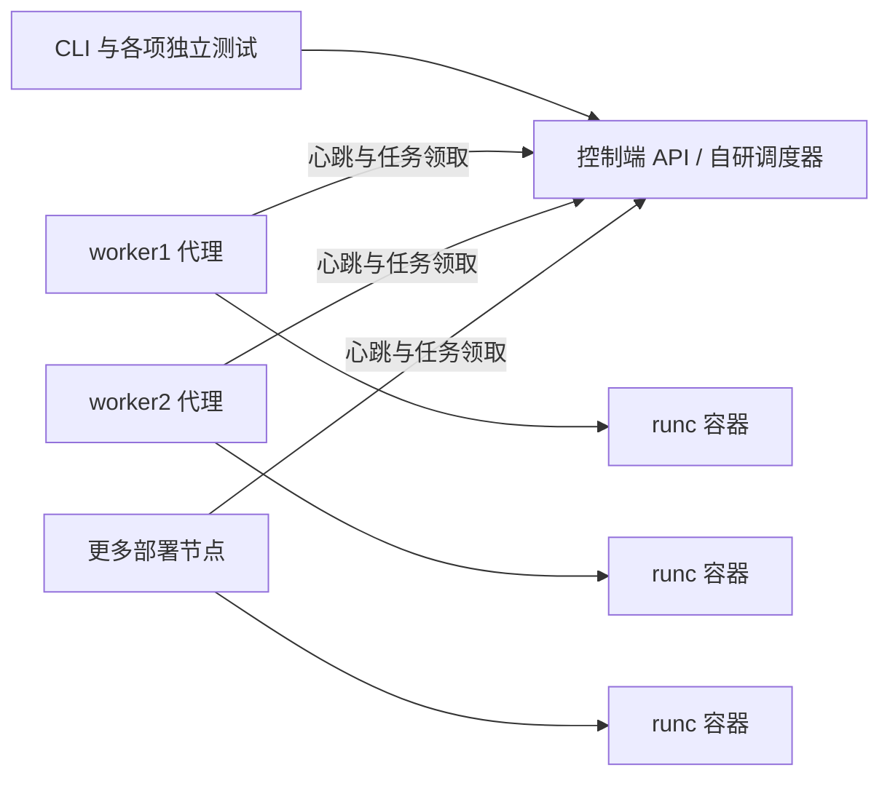

# RCS 自研 runc 多节点容器调度系统

控制服务自行实现资源记账、调度、副本维护、亲和性、污点、优先级抢占和基于指标的扩缩容。部署节点代理生成 OCI 配置，调用 runc 创建真实容器。MPI 用例由本系统部署任务、设置资源限额并收集结果，集合通信调用 Open MPI 标准库。

本次交付面向 **RISC-V 64 位处理器、openEuler 22 系列**。支持一台控制机器加一台部署机器，并可继续增加 worker2、worker3 等节点。

0.1.2 支持 **cgroup v1 和 v2 自动检测**，按现有 cgroup v1 环境即可部署。节点可通过 cgroupMode 固定为 v1/v2，版本与 systemd/cgroupfs 管理方式分别配置。

## 文档入口

- [openEuler / RISC-V 编译、配置和运行](docs/openeuler-riscv64.md)：原生编译、交叉编译、两台设备部署、多节点扩展、MPI rootfs 和排查。
- [13 项独立测试说明](docs/testcases.md)：每项大纲用例的脚本、命令、判定条件和报告位置。
- [cgroup v1 适配与检查](docs/cgroup-v1.md)：控制器要求、指标来源、配置和已有安装更新。
- [本地验证记录](VERIFICATION.md)：已完成的检查，以及需要在实际服务器验证的内容。



## 文件入口

| 内容 | 位置 |
|---|---|
| RISC-V Linux 二进制 | `bin/rcs-linux-riscv64` |
| RISC-V 原生编译 | `scripts/build-openeuler-riscv64.sh` |
| openEuler 环境检查 | `scripts/check-openeuler-riscv64.sh` |
| 控制端和节点配置 | `configs/controller.json`、`configs/worker1.json`、`configs/worker2.json` |
| systemd 安装 | `scripts/install.sh` |
| 最小测试 rootfs | `scripts/prepare-demo-rootfs.sh` |
| openEuler MPI rootfs 构建 | `scripts/create-openeuler-mpi-rootfs.sh` |
| MPI 程序与 SSH 配置 | `scripts/prepare-mpi-rootfs.sh`、`mpi/` |
| 逐项测试 | `testcases/01_*.py` 至 `testcases/13_*.py` |

每个编号脚本只运行对应测试，自行准备和清理环境。`common.py`、`mpi_common.py` 为辅助库，没有批量测试入口。旧的 `scripts/acceptance.py` 和 `scripts/mpi-test.py` 已移除。

## 配置和运行行为

`requests.cpuMillis` 的 1000 表示一个 CPU 核，内存单位为字节。调度按 requests 预留资源，runc 按 limits 设置 CPU quota 和内存上限。节点默认从物理 CPU、内存扣除 reserve，capacity 可显式覆盖上报容量，需按硬件设置。

每个容器有独立 rootfs、PID、IPC、UTS 和挂载命名空间，网络使用宿主机网络。hostPorts 用于调度时预留端口，应用需按申报端口监听。镜像名称对应节点本地 rootfs 目录，通过代理 images 配置公布。

nodeSelector 为 AND；nodeAffinity 多个 term 为 OR，term 内表达式为 AND，支持 In、NotIn、Exists、DoesNotExist。Pod 亲和性和反亲和性按 selector、topologyKey 匹配已分配容器。污点支持 NoSchedule、PreferNoSchedule、NoExecute，后者在节点同步时停止不容忍的容器。

优先级整数越大越优先。`preemptible: false` 禁止成为抢占受害者。抢占先请求停止低优先级容器，待代理确认停止或完整清单确认不存在后释放预留。失联节点保留已有预留，恢复连接后核对状态。

job 的 replicas 为批次执行数，成功或失败均计入已执行次数；重新运行需先 delete 再 apply。deployment 容器退出后重建，失败后有 10 秒重试间隔。模板修改会停止旧代容器并创建新代。

扩缩容采用 `ceil(副本数 × 平均资源利用率 / 目标利用率)`，配合 min/max、10% 容差、冷却时间和缩容窗口。v1 按容器 init PID 的真实控制器路径读取 cpuacct.usage 和 memory.usage_in_bytes；v2 使用 runc stats。缺少有效指标时不据此缩容，启用 autoscaler 后拒绝手工 scale。

控制状态文件原子替换并在重启时加载，只允许一个控制进程写同一状态文件。代理重启可识别仍运行的容器。物理节点重启后可重建 deployment；无法取得已退出 Job 的退出码时记录失败。

exec 面向短命令，最多执行 20 秒、输出 64KiB；代理进程内对重试去重，执行期间代理崩溃时结果可能不确定。控制端保存最近 32KiB 容器日志，测试在清理前写入报告。节点原始日志随容器清理删除。

默认 HTTP 用于受控实验网。可配置控制端 tlsCert/tlsKey、节点 caFile、CLI -ca 和测试 --ca 使用 HTTPS。管理 token 与节点 token 分离，当前使用共享节点凭据及可信工作负载模型。

## 手工操作

部署成功后在控制端设置 RCS_URL、RCS_TOKEN_FILE：

```bash
rcs ctl get nodes
rcs ctl apply examples/elastic.json
rcs ctl wait elastic 360
rcs ctl get pods
rcs ctl get events
rcs ctl exec 容器ID -- /usr/local/bin/rcs marker on
rcs ctl logs 容器ID
rcs ctl label worker1 zone=zone1
rcs ctl taint worker1 dedicated=test:NoSchedule
rcs ctl untaint worker1 dedicated
rcs ctl cordon worker1
rcs ctl uncordon worker1
rcs ctl delete elastic
```

手工操作后先删除工作负载，再运行需要空闲节点的测试。pod-affinity 示例匹配 app=elastic，需先运行 elastic；pod-anti-affinity 的两副本分散需要两个部署节点。
